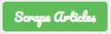

# Mongo-cheerio

Mongo-Cheerio web uses several Node.js packages with focus in Cheerio and Mongo db.

## Languages
- HTML
- CSS
- JQuery
- Bootstrap
- JavaScript
- Node.Js
- MongoDB
- JSON

## npm Packages
- cheerio
- moongose
- handlebars
- body-parser
- express
- request
 
 Mongo-Cheerio Reads through the NYT API to requesting JSON objects of the 5 headings of the day. Once this request is succesfully process, Mongo-Cheerio App stores this data in MongoDB. Then, headings are displayed to the user in a friendly format.
 
 Users can:
 
 1-   Scrape Articles by pressing the scrape button.  
 .     
 
 2- Delete the articles scraped.  
  .
 3- See the incoming JSON Object.  
 .
 
 See how it works [Mongo-Cheerio](https://aqueous-falls-53542.herokuapp.com/)
 
 

